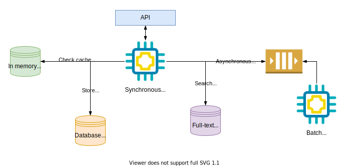

# Designing data-intensive applications

## Standard Building blocks

* **Databases** to store data
* **Caches** to speed-up reads or remember expensive operation
* **Queues/Streams** for asynchronous processing
* **Indexes** for searching and filtering stored data
* **Offline processing** for crunching accumulated data or async operations

