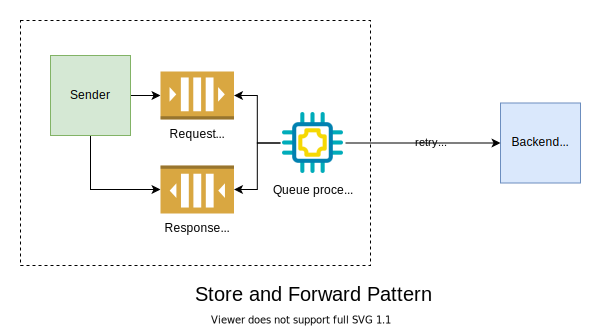

# Fallacies of Distributed Computing

## Network is reliable

Calls over network can fail for various reasons. Therefore,

* Do **automatic retries** with **idempotency**
* Implement **store and forward pattern** with queues

## Latency is zero

Sending data across a network is multiple orders of magnitude slower than making a local method call. Therefore,

* Avoid chatty network communication by bringing all the data at once
* Avoid [Select N+1](https://stackoverflow.com/questions/97197/what-is-the-n1-selects-problem-in-orm-object-relational-mapping) problem by keeping remote calls coarse-grained
* Move the data closer to client - CDNs & Caching
* Invert flow of data - use pub/sub model with local storage

## Bandwidth is infinite

Mobile and video streaming apps are sensitive to high bandwidth usage. Therefore,

* Use Domain driven design
	* Don't strive for single enterprise domain model but rather partition domain model into [BoundedContexts](https://martinfowler.com/bliki/BoundedContext.html)
	* Avoid large object graph inside bounded contexts by using [Aggregate pattern](https://martinfowler.com/bliki/DDD_Aggregate.html)
* Use CQRS - [Command Query Responsibility Separation](https://martinfowler.com/bliki/CQRS.html)
	* Optimize read and write with separate models

## Network is secure

Since security cannot be an afterthought, 

* Do layered defense at different levels - network, application, storage
* Handle [OWASP Top 10](https://owasp.org/www-project-top-ten/) vulnerabilities
* Implement threat modelling 
	* identify assets and access patterns 
	* identify possible attacks and execute them

## Topology doesn’t change

Since network topology changes all the time, we need to

* Abstract physical network
	* Don’t hardcode IPs - use DNS
	* Use service discovery when IP and port are needed
	* Use Service bus or multi cast for location transparency
* Treat servers as Cattle, Not pets
* Implement Chaos monkey

## There is one administrator

In a complex system, it is impossible for one person to know everything. Therefore, 

* Implement Centralized logging & monitoring
* Involve administrators early to spot production constraints (security, firewall, configurations)
* Decouple systems with queues
* Implement backward-compatible connections to allow for independent component upgrades
* Isolate/Abstract 3rd party systems

## Transport cost is zero

Transporting data over network has a price both in time and resources. Serializing and deserializing data for transport involves CPU time and network infrastructure involves atleast a maintenance cost. Therefore, 

* Choose the transport format wisely
	* XML > JSON > ProtoBuf (in the order decreasing cost)

## Network is homogeneous
 
Having a homogeneous network is impossible to achieve. Therefore,

* Avoid vendor lock-in with proprietary protocols
* Choose standard formats for communication - Json, XML, etc

---
**References**

* [Understanding the 8 Fallacies of Distributed Systems - Dzone](https://dzone.com/articles/understanding-the-8-fallacies-of-distributed-syste)
* [Whitepaper - Arnon Rotem-Gal-Oz](https://www.rgoarchitects.com/Files/fallacies.pdf)
