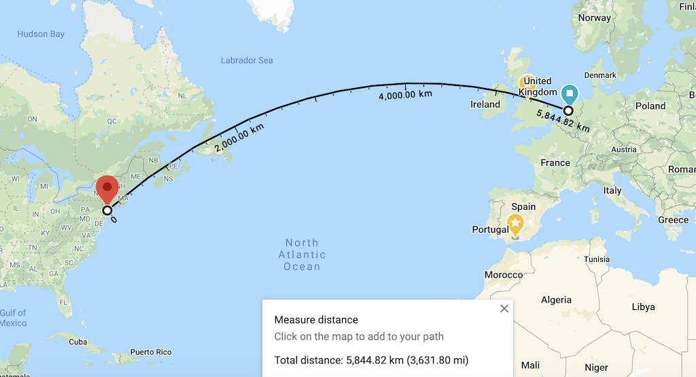

# Networking 101

[History of Internet](https://www.youtube.com/watch?v=BQFprTs2Gso) (video)

## Ip Address Exhaustion Solution

Class based network

* Class A - 16 million = 2^24
* Class B - 65,536
* Class C - 256

Possible solutions:

* NAT - Having private address
* CIDR - Classless Inter domain routing
* Reclaim addresses
* IPv6 - 128 bit addresses = 

## Speed is a feature

|Delay|	User perception|
|----|----|
|0–100 ms	|Instant|
|100–300 ms	|Small perceptible delay|
|300–1000 ms|Machine is working|
|1,000+ ms	|Likely mental context switch|
|10,000+ ms	|Task is abandoned|

[source](https://hpbn.co/primer-on-web-performance/#speed-performance-and-human-perception)

Because faster sites mean

* better user engagement
* better user retention
* better conversion

> Transatlantic cable "[Hibernia Express](https://en.wikipedia.org/wiki/Hibernia_Express)" was laid between London and NewYork to give an edge of `~5 milliseconds` over other transatlantic cables

Latency is caused by

* **Propogation delay** = distance/speed of medium(light)
* **Transmission delay** = time required to push all data bits into the link
	* Transmitting 10MB data over 100Mbps link would be faster (0.8 sec) than sending it over 1Mbps link (80 sec). 10MB = 80Mb
* **Processing delay** = time taken by router to process the packet header, check for bit-level errors and determine packet's destination
* **Queuing delay** = time the packet waits in router's incoming buffer before it can be processed

Refractive Index = Speed of light / Speed of light in the medium

Eg., Refractive index of Optical fiber is \~1.4. Therefore, maximum speed of light in optical fiber = 200,000,000 m/sec

|Route|Distance|Latency|RTT|
|------|-----|-----|-----|
|NewYork to SanFrancisco| ~4000km | ~20ms |~40ms |
|NewYork to Amsterdam| ~6000km | ~30ms |~60ms |
|NewYork to Sydney| ~16000km | ~80ms |~160ms |
|Earth's Circumference| ~40000km | ~200ms |~200ms |

## TCP

TCP provides an effective abstraction of a reliable network running over an unreliable channel. It hides most of the complexity of network communication from our applications: 
* retransmission of lost data
* in-order delivery 
* congestion control and avoidance
* data integrity
* and more

TCP is optimized for accurate delivery, rather than a timely one.

### Three-way Handshake

Thus, each new connection will have a full roundtrip of latency before any application data can be transferred.

### Congestion Avoidance and Control

### Design Philosophy of DARPA Internet Protocols

[source](http://ccr.sigcomm.org/archive/1995/jan95/ccr-9501-clark.pdf)

#### Fundamental Goal

* Effective technique for multiplexed utilization of existing interconnected networks (ARPANET, PRNET)
	* Sharing/multiplexing was solved with Packed switching
	* Interconnection was solved with `narrow waist`

[Udacity course](https://www.youtube.com/watch?v=uXumm52oBMo)

#### Secondary goals

* Survivability in the face of failure:
	* Replication
	* Fate-sharing - acceptable to lose state information of an entity if the entity itself is lost. Eg., Routing tables lost when a router crashes
* Heterogenity
	* achieved through TCP/IP
		* TCP provided flow control and reliability though some usecases didn't need it. Eg., streaming (voice/video), DNS resolution
		* TCP works on best effort which makes debugging hard
* Distributed Management
	* Addressing (ARIN, RIPE, etc)
	* Naming (DNS) 
	* Routing (BGP)

#### End-to-End Argument
[source](https://web.mit.edu/Saltzer/www/publications/endtoend/endtoend.pdf)

Summary: **Dumb network and intelligent endpoints** 

Eg., Violation NAT which maintains a map of device ip and port on private network to the static public ip and port

### Switching & Bridging

#### Host hosts find each other on the network

Each `Network Adapter` has a MAC address and a computer can send a Ethernet datagram to another computer if it knows the recipient's MAC address. But in reality only DNS name or IP of the destination machine is known.

**ARP protocol**

* Broadcast asking for IP. 
* Receive a unicast with MAC address 
* Build a table of IP to MAC address 

Hub : Broadcast
Switch: Do traffic isolation

Learning Switch

* Floods the network when there is no mapping. Otherwise, send to the correct port.

Loop and Broadcast Storms

### Routing

Types:
* Intradomain
* Interdomain

Different Autonomous Systems (AS):
* ISPs
* Service providers (Google, etc)
* Standalone institutions (Universities)

Node = PoPs (Points of Presence) usually located in densely populated centers
Edges have fiber paths which are closer to major transportational routes

#### Intradomain routing

##### Distance-Vector routing
Uses Bellmann-Ford algorithm

---
**References**:

* 