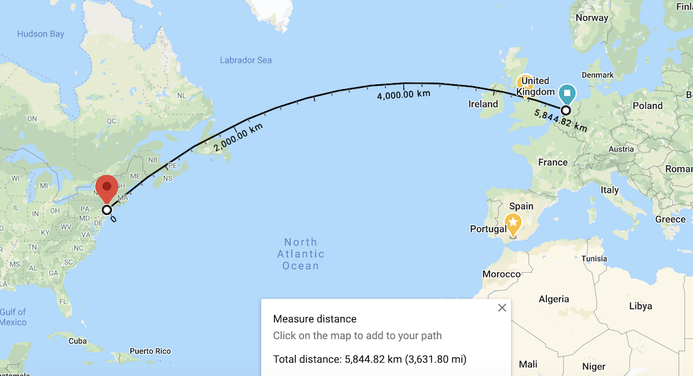
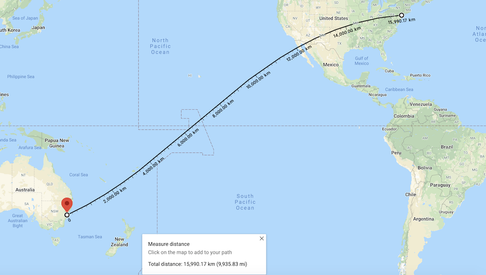

# Website Performance

## Speed is a feature

|Delay|	User perception|
|----|----|
|0–100 ms	|Instant|
|100–300 ms	|Small perceptible delay|
|300–1000 ms|Machine is working|
|1,000+ ms	|Likely mental context switch|
|10,000+ ms	|Task is abandoned|

[source](https://hpbn.co/primer-on-web-performance/#speed-performance-and-human-perception)

Because faster sites mean

* better user engagement
* better user retention
* better conversion

> Transatlantic cable "[Hibernia Express](https://en.wikipedia.org/wiki/Hibernia_Express)" was laid between London and NewYork to give an edge of `~5 milliseconds` over other transatlantic cables

Latency is caused by

* **Propogation delay** = distance/speed of medium(light)
* **Transmission delay** = time required to push all data bits into the link
	* Transmitting 10MB data over 100Mbps link would be faster (0.8 sec) than sending it over 1Mbps link (80 sec). 10MB = 80Mb
* **Processing delay** = time taken by router to process the packet header, check for bit-level errors and determine packet's destination
* **Queuing delay** = time the packet waits in router's incoming buffer before it can be processed

Refractive Index = Speed of light / Speed of light in the medium
Eg., Refractive index of Optical fiber is \~1.4

Therefore, Max. possible speed of light = 200,000,000 m/sec

|Route|Distance|Latency|RTT|
|------|-----|-----|-----|
|NewYork to SanFrancisco| ~4000km | ~20ms |~40ms |
|NewYork to Amsterdam| ~6000km | ~30ms |~60ms |
|NewYork to Sydney| ~16000km | ~80ms |~160ms |
|Earth's Circumference| ~40000km | ~200ms |~200ms |

## Best practices of Web performance

* Optimize DNS Lookups
	* Limit the number of unique domain names
	* Ensure low DNS resolution latencies
	* Leverage [DNS pre-fetch](https://developer.mozilla.org/en-US/docs/Web/Performance/dns-prefetch)
* Optimie TCP connections
	* Leverage [Preconnect](https://www.keycdn.com/support/preconnect) which sets up early connections before an HTTP request is actually sent to the server
	* Use a CDN closer to user. This indirectly reduces the RTT for the TCP connection
	* Implement latest [TLS best practices](https://istlsfastyet.com/)
	* Avoid Redirects - that usually causes connection to new hostnames
* Cache on client - TTL
	* Cache images forever
	* CSS/JS - cache for twice the median session time so it is relatively fresh
* Use conditional caching
	* Using [ETag](https://developer.mozilla.org/en-US/docs/Web/HTTP/Headers/ETag) that uniquely identifies the object so server can return HTTP 304 if it is requested again
	* Using [If-modified-since](https://developer.mozilla.org/en-US/docs/Web/HTTP/Headers/If-Modified-Since) in http request so server can return HTTP 304
* Compression and Minification
	* All text content (Html,JS,CSS,Json) benefit from compresison - gzip, deflate
* Avoid Blocking CSS/JS
	* Add all the CSS elements in the head section
	* Use 'async' attribute for JS than be downloaded parallely while HTML is being parsed but before the DOM is loaded
	* Use 'defer' attribute for JS that can be run after DOM is loaded
* Optimize Images
	* Remove metadata like location, timestamp, image dimension, resolution 
	* Scaling images for different viewport

## Anitpatterns with HTTP/2
* Domain Sharding as that creates multiple TCP connections 
* CSS Spriting
* Concatenation of files
* [Inlining](https://hpbn.co/http1x/#resource-inlining) 

--- 

**References**

* [High Performance Browser Networking - Oreilly](http://shop.oreilly.com/product/0636920028048.do) (book)
* [High Performance websites - Oreilly](http://shop.oreilly.com/product/9780596529307.do) (book)
* [Building Fast & Resilient Web Applications - Ilya Grigorik](https://www.youtube.com/watch?v=aqvz5Oqs238)(video)